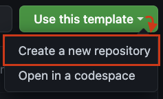

# Serko Exercise: Country Dropdown

**Welcome to this exercise repository.**

The intention for this exercise is to understand a bit more about how you work as a frontend focussed engineer.

We would like you to spend up to 2 hours of your time on this exercise. You can use the [context](CONTEXT.md) file to add any notes that you feel will help us understand how you would continue or improve your solution with more time.

---

## Creating your workspace

We are utilising Github's template repository feature. Please create your own copy of this repository by clicking the **"Use this Template"** button and selecting the **"Create a new repository"** option.

When you are done, please submit the URL to your Github repo back to us.

---

## Where to start

- Please head over to read the [instructions](INSTRUCTIONS.md)
- Also consider the [context](CONTEXT.md) file we have provided for your notes
- Familiarise yourself with the [Figma design file](https://www.figma.com/design/SUGslQZNhRzH86OU7T4e8G/Interview-project-1---Engineer?node-id=11-2&p=f&t=SOMvJuYpVxf2uuMR-0) that shows the desired outcome (you may need to create a Figma account to inspect the file)
  - We have added 2 preview screenshots to this repository but the Figma design file is the source of truth and contains all values, like colours or padding, needed to build the components
  - [Dropdown states preview](Dropdown%20states%20preview.png)
  - [Dropdown values preview](Dropdown%20values%20preview.png)

---

## How to get running

### Prerequisites

- Node LTS, we have tested this exercise using version 22.x

### Running code

In order to save time with project setup, we have created a minimal sandbox environment using Vite. This should allow you to jump straight into solving the problem and not need to spend time setting up the basic tools and dev server.

1. `npm install` to install the dependencies required
2. `npm run dev` to launch the Vite powered dev server for local development

MSW has been pre-configured with the appropriate mock data to simulate an API. You can see the result in your browser's console once the dev server is running.

Types for this mock API have been provided in the `src/types/api.d.ts` file. The `src/utils` folder contains a basic fetch function for demonstration purposes. You are welcome to use these utility functions or create your own.
